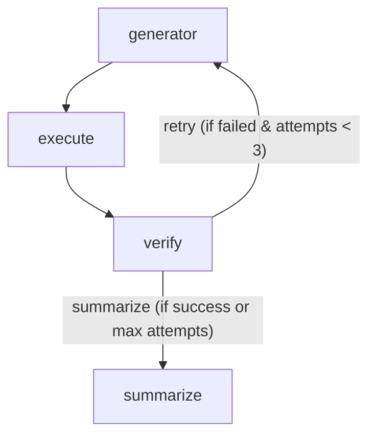

# Rogue AI - File Manager Agent

Rogue AI is an intelligent, autonomous agent built using [LangGraph](https://python.langchain.com/docs/langgraph) and [LangChain](https://python.langchain.com/docs/get_started/introduction). This project features a robust **File Manager Agent** that interprets user requests in natural language, writes the necessary Python code to achieve the goal, executes it securely, and dynamically verifies the outcome.

## 🚀 Key Features

- **Autonomous Code Generation**: Translates natural language requests into executable Python code designed for file system operations and system interactions.
- **Self-Correcting Loop**: Employs an iterative execution-verification cycle. If a generated script fails or doesn't meet the user's expectations, the agent analyzes the failure and retries up to three times.
- **Secure Execution Environment**: Python scripts are generated on the fly, stored in temporary files, and executed using `subprocess` with timeouts and robust error handling to prevent hangs and system crashes.
- **Intelligent Verification**: Uses an LLM to automatically verify if the standard output and errors from the execution match what the user originally requested.

## 🧠 How It Works

The File Manager Agent uses a state graph architecture (`StateGraph`) with four distinct nodes:

1. **`code_generator_node`**: Takes the user's prompt (along with context from previous failed attempts, if any) and generates raw, executable Python code.
2. **`code_executor_node`**: Writes the generated code to a temporary `.py` file, executes it in a subprocess, and captures `stdout` and `stderr`.
3. **`verifier_node`**: Analyzes the original request, the generated code, and the output/error. It determines if the operation was successful and matches the user's intent.
4. **`summarizer_node`**: Compiles the final response. If successful, it delivers a friendly completion message. If the maximum retries are reached without success, it explains what went wrong and suggests alternatives.

### Graph Flow



## 🛠️ Technologies Used

- **Python 3**
- **LangChain Core** (`HumanMessage`, `SystemMessage`, `AIMessage`)
- **LangGraph** (`StateGraph`, `END`, `add_messages`)
- Standard Python Libraries: `subprocess`, `tempfile`, `os`, `re`, `typing`

## 🏃‍♂️ Quick Start

1. Ensure your environment has the necessary LLM utilities set up (this project expects a `load_model` utility configured for your preferred LLM provider).
2. Run the agent script:
   ```bash
   python first_agent.py
   ```
3. By default, the script executes a sample prompt: *"Find what operating system I am in. Then gather some intelligent OS and program data from the computer. And tell me what you know about me."*

## 💡 Example Use Cases

- "List out all files and folders in the desktop directory"
- "Create a new folder called 'reports' and move all PDF files from Downloads into it."
- "Find the largest file in my Documents folder and tell me its size."

---
*Note: This agent executes code directly on your local machine. Use caution and ensure the LLM you use is trusted when requesting complex or potentially destructive file operations.*
