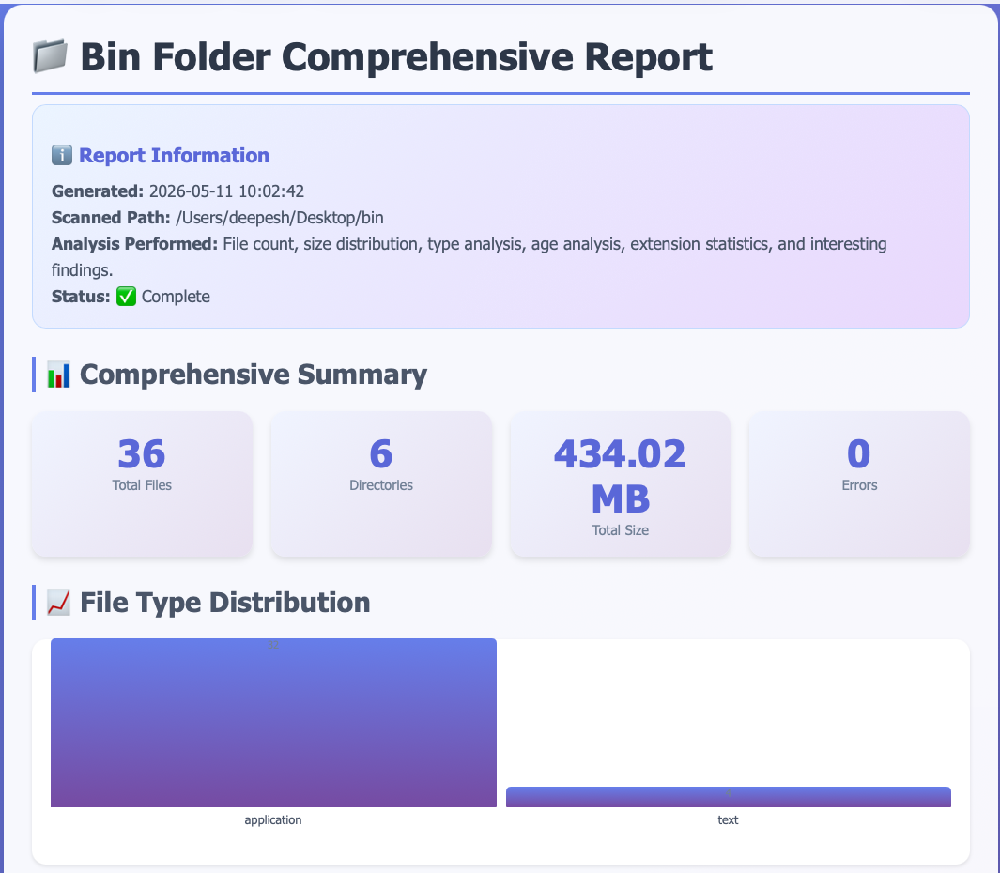
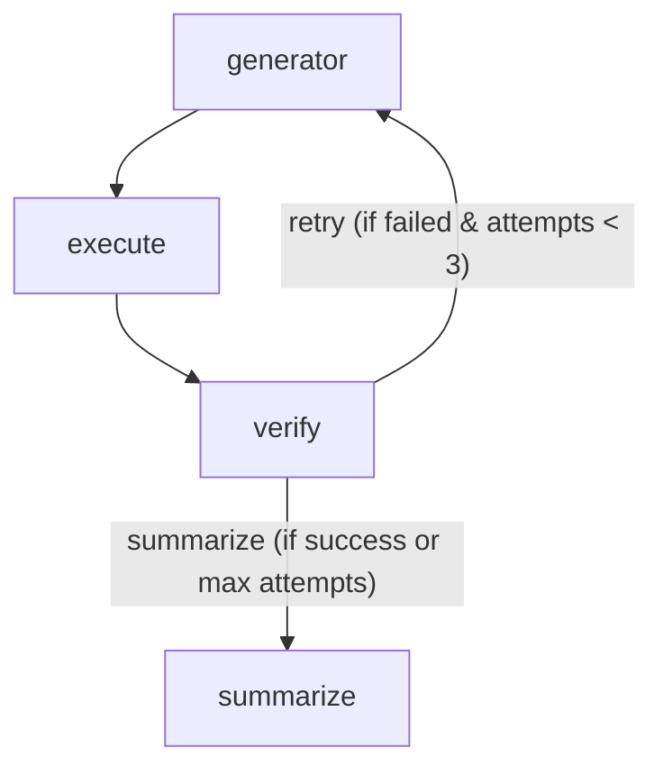

# Rogue AI - File Manager Agent

```bash
$ uv run main.py
🦧 How may I help you?
➡ Create a comprehensive report on my ~/Desktop/bin folder, and save it as a ~/Desktop/bin.html file in a visually appealing way. remember to include comprehensive summary section at the top. Go with soothing colors. Remember to add a information section on top to show what was done. Come up with some sort of chart based analysis and try to find some inter^[interesting stuff.
Of course! Here is a clear and friendly completion message for your report generation task.


**✅ Report Generation Complete!**

Hello! Your comprehensive report on the `~/Desktop/bin` folder has been successfully created and saved.

**What was done:**
- **Scanned** the `/Users/deepesh/Desktop/bin` directory.
- **Analyzed** the contents, finding **36 files** organized across **6 directories**.
- **Generated** a visually appealing HTML report with soothing colors.
- **Included** a comprehensive summary section at the top, detailing the analysis.
- **Added** an information section explaining what was accomplished.
- **Created** a chart-based analysis to visualize file types, sizes, and distribution.
- **Discovered** some interesting insights (e.g., most common file types, largest files, or unusual extensions).

**File Details:**
- **Location:** `~/Desktop/bin.html`
- **Size:** 16.45 KB

You can now open the `bin.html` file in any web browser to view your interactive report. The soothing color palette and clear layout should make it easy to digest the information at a glance.

If you need any further modifications or additional analysis, feel free to ask!
```



Rogue AI is an intelligent, autonomous agent built using [LangGraph](https://python.langchain.com/docs/langgraph) and [LangChain](https://python.langchain.com/docs/get_started/introduction). This project features a robust **File Manager Agent** that interprets user requests in natural language, writes the necessary Python code to achieve the goal, executes it securely, and dynamically verifies the outcome.

## 🚀 Key Features

- **Autonomous Code Generation**: Translates natural language requests into executable Python code designed for file system operations and system interactions.
- **Self-Correcting Loop**: Employs an iterative execution-verification cycle. If a generated script fails or doesn't meet the user's expectations, the agent analyzes the failure and retries up to three times.
- **Secure Execution Environment**: Python scripts are generated on the fly, stored in temporary files, and executed using `subprocess` with timeouts and robust error handling to prevent hangs and system crashes.
- **Intelligent Verification**: Uses an LLM to automatically verify if the standard output and errors from the execution match what the user originally requested.

## 🧠 How It Works

The File Manager Agent uses a state graph architecture (`StateGraph`) with four distinct nodes:

1. **`code_generator_node`**: Takes the user's prompt (along with context from previous failed attempts, if any) and generates raw, executable Python code.
2. **`code_executor_node`**: Writes the generated code to a temporary `.py` file, executes it in a subprocess, and captures `stdout` and `stderr`.
3. **`verifier_node`**: Analyzes the original request, the generated code, and the output/error. It determines if the operation was successful and matches the user's intent.
4. **`summarizer_node`**: Compiles the final response. If successful, it delivers a friendly completion message. If the maximum retries are reached without success, it explains what went wrong and suggests alternatives.

### Graph Flow



## 🛠️ Technologies Used

- **Python 3**
- **LangChain Core** (`HumanMessage`, `SystemMessage`, `AIMessage`)
- **LangGraph** (`StateGraph`, `END`, `add_messages`)
- Standard Python Libraries: `subprocess`, `tempfile`, `os`, `re`, `typing`

## 🏃‍♂️ Quick Start

1. Create and activate a virtual environment:
   ```bash
   python -m venv .venv
   source .venv/bin/activate  # On Windows use: .venv\Scripts\activate
   ```
2. Copy the example environment file and add your API credentials:

   ```bash
   cp .env.example .env
   ```

   _Open the `.env` file and fill in your OpenAI (or compatible) API information._
   1. DEEPSEEK_API_KEY from api.deepseek.com or other LLM provider API key, and modify INFERENCE_API_URL accordingly in .env file.

3. Optional: Langsmith tracing. Create langsmith project, and copy project name and api key
   LANGSMITH_API_KEY=""
   LANGSMITH_PROJECT=""
4. Run the agent script using `uv` (this will automatically install required dependencies):
   ```bash
   uv run main.py
   ```
5. You will be prompted in the terminal to enter your request:
   `🦧 How may I help you?`
   `➡ `

## 💡 Example Use Cases

- "List out all files and folders in the desktop directory"
- "Create a new folder called 'reports' and move all PDF files from Downloads into it."
- "Find the largest file in my Documents folder and tell me its size."

---

## Warning

_Note: This agent executes code directly on your local machine. Use caution and ensure the LLM you use is trusted when requesting complex or potentially destructive file operations._

_Don't prompt something stupid like "delete all my desktop folders"_. You have been warned.

## License

This project is licensed under the Apache License 2.0 - see the [LICENSE](LICENSE) file for details.
